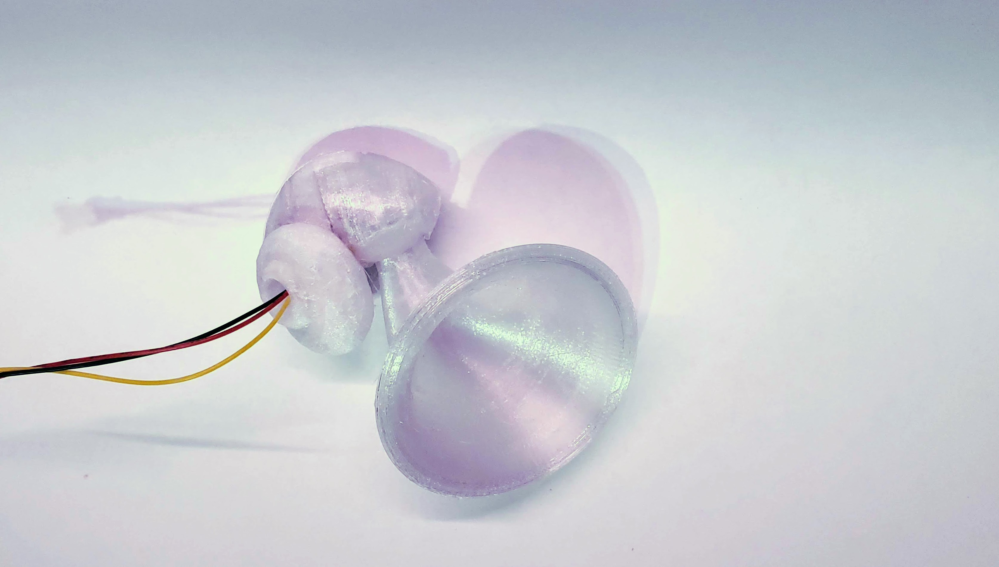
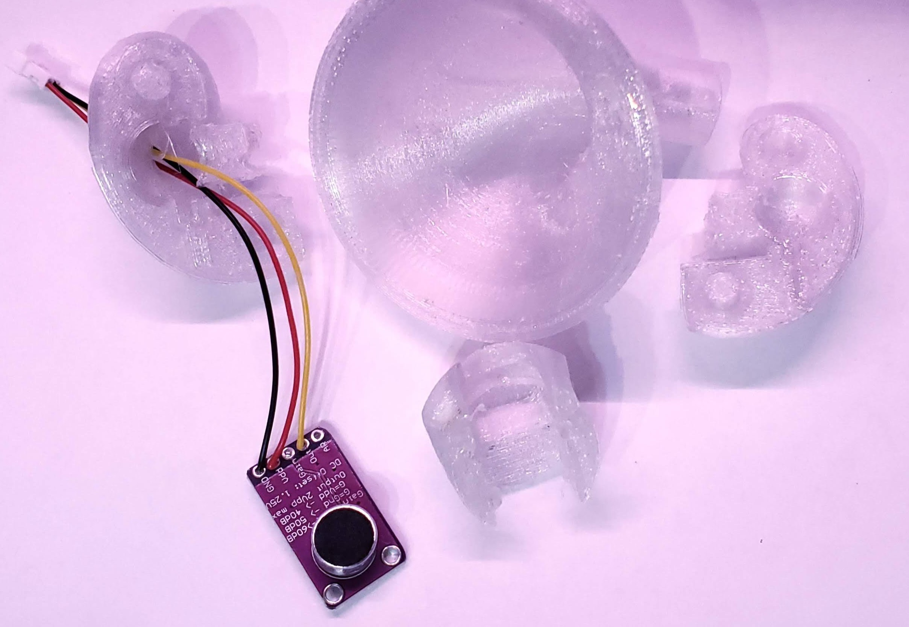

# Tympanic Case
This is a Silly little case designed to wrap around generic "MAX9814 Electret Microphone Amplifier with Auto Gain Control for Arduino"

The case is loosely based on an inner ear. The "tubes" parts are based on an anatomically accurate model of that part of the human inner ear.
The "tubes" parts are completely superflious. 

This case was specificly tested with [MAX9814 ](https://smile.amazon.com/ACEIRMC-MAX9814-Electret-Microphone-Amplifier/dp/B08RHP5WTW?pd_rd_w=yFgtD&pf_rd_p=669284d1-0739-4910-99f9-d216bdde93da&pf_rd_r=QMEAC5HNM55H4T8D661F&pd_rd_r=6e7c3128-0ad8-4d59-afea-c092e6acded8&pd_rd_wg=uans6&pd_rd_i=B08RHP5WTW&psc=1&ref_=pd_bap_d_rp_19_i)

This directory contains a ready to print STL layout exported from PrusaSlicer
A prusaslicer settings file
Individual STL files for each part: WARNING the individual part STL files are NOT oriented

To print this I used adaptave layer height, and upped perimeters to 3, and for the horn 4, also wide brims for the little parts

The pictures shown where of a print using generic cheap transparent PTEG, which came out rather stringy. This should look beautyful in a nice PLA, like some of @Proto_pasta
 Bobbi's Purple Iris HTPLA"

## Have Headders? No Fear!
THIS CASE WILL WORK WITH HEADDERS
This case is designed for a mike with headders, or wires directly soldered to the board. 
If the micraphone has Headder pins installed facing the opposite direction from the micraphone the case will work Just Fine

 

## Assembly
NO GLUE NEEDED Snaps together 
### First assemble the two halves of the "cochlea"
 

-   Orient the micraphone into one of the two halves of the cochlea
-   The big round cavity is where the wire end goes
-   feed wires from the board through the hole, this will help you orient the micraphone

 
### Attach the other half of the cochlea
-   There are 2 Pegs, a short one and a long one
-   They go in the 2 halves of the "cochlea" 
-   The pegs should friction fit the two havles together

### Slide the 3rd cochlea piec over the micraphone
 
- This part has two little dimples that slide into slots and hold the 2 halves of the cochlea together

### Optional Horn
 

- The Horn is totally optional but fun
- The base of the horn has 2 pegs that fit into slots right around the micraphone
- There is a cavity for the pegs to ride in so the horn can be twisted whatever way you want

### Really Optional Tubes
- The tubs come in 2 halves totally superflious
- Glue the 2 halves together
- There are 2 diviots that should let you Glue it to the cochlea

# License

licensed under [Creative Commons Attribution Share-Alike license](https://creativecommons.org/licenses/by-sa/4.0). 
